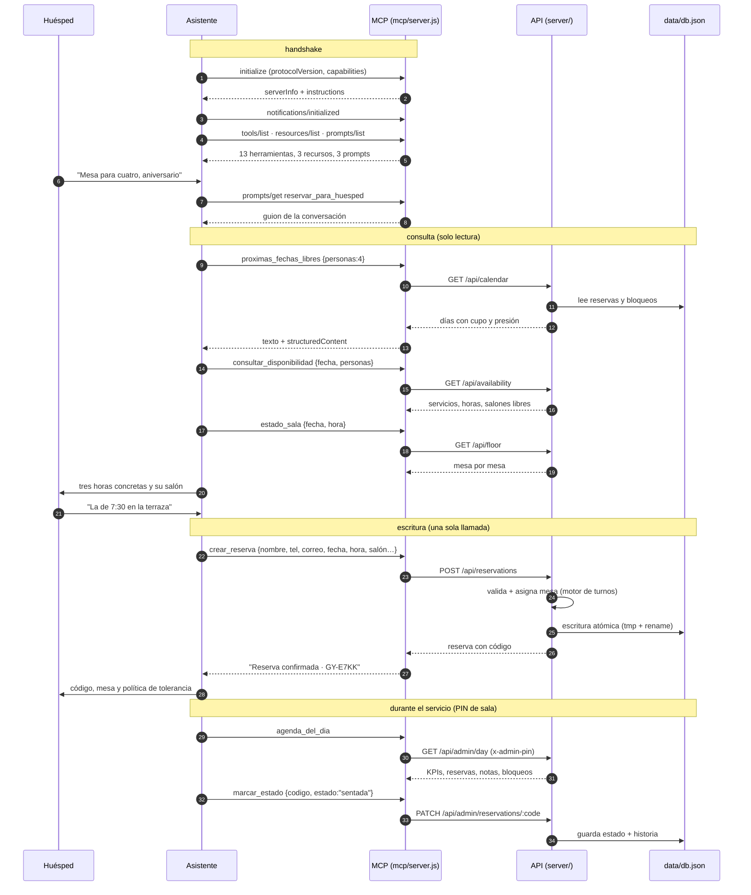
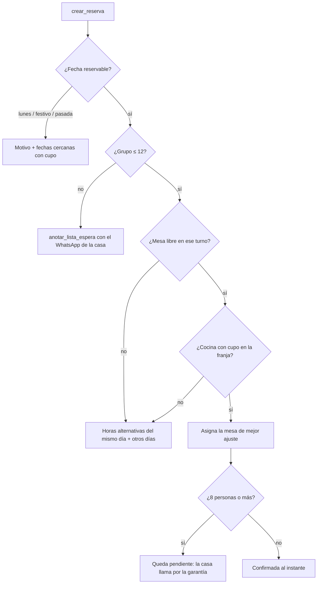

# El Guayacán · el MCP y su flujo

El servidor MCP (`mcp/server.js`) le entrega a un asistente las mismas
capacidades que tiene la web: consultar la agenda, reservar, mover mesas y leer
la carta. No duplica lógica: llama la API HTTP del restaurante, así que el motor
de disponibilidad es exactamente el mismo que usa el sitio.

```
Asistente ── JSON-RPC 2.0 (stdio) ──> mcp/server.js ─┐
                                                     ├─> mcp/protocol.js ── HTTP ──> server/ ──> data/db.json
Postman  ── JSON-RPC 2.0 (POST /mcp) ─> server/index ─┘
```

El catálogo y el despachador viven en `mcp/protocol.js`; encima hay dos
transportes que no duplican nada: **stdio** (`mcp/server.js`, el que levanta
Claude Code) y **HTTP** (`POST /mcp` del propio restaurante, para depurar y
para verlo en Postman).

## Cómo se conecta

Ya está declarado en [`.mcp.json`](../.mcp.json), así que en este proyecto
Claude Code lo levanta solo. A mano:

```bash
npm start          # el restaurante, en otra consola
node mcp/server.js # el MCP habla por stdin/stdout
```

Variables: `GUAYACAN_URL` (default `http://127.0.0.1:4321`) y `GUAYACAN_PIN`
(default `2408`, habilita las cuatro herramientas de sala).

## Las 13 herramientas

| Herramienta | Tipo | Para qué |
| --- | --- | --- |
| `consultar_disponibilidad` | lectura | Horarios con mesa para un día y un grupo |
| `proximas_fechas_libres` | lectura | "¿Cuándo hay para seis?" en los próximos N días |
| `estado_sala` | lectura | Plano mesa por mesa a una fecha y hora |
| `ver_carta` | lectura | Platos, precios, filtro vegetariano |
| `buscar_reserva` | lectura | Por código o por teléfono |
| `crear_reserva` | escribe | Reserva y devuelve el código |
| `modificar_reserva` | escribe | Cambia fecha, hora o número de personas |
| `cancelar_reserva` | escribe · destructiva | Libera la mesa |
| `anotar_lista_espera` | escribe | Día lleno o grupo de más de 12 |
| `agenda_del_dia` | lectura · PIN | Vista de servicio con notas de preparación |
| `marcar_estado` | escribe · PIN | Confirmada, sentada, completada, no-show |
| `bloquear_franja` | escribe · PIN · destructiva | Cierra mesas, salón o casa por un rango |
| `metricas` | lectura · PIN | Cubiertos, ocupación, cancelaciones, no-shows |

Cada resultado vuelve en dos formas a la vez: **texto** listo para leerle a una
persona y `structuredContent` con el JSON crudo para que el modelo encadene la
siguiente llamada sin re-parsear prosa.

### Recursos

| URI | Contenido |
| --- | --- |
| `guayacan://restaurante` | Horarios por día, salones, mesas, políticas, experiencias |
| `guayacan://carta` | La carta completa con precios |
| `guayacan://agenda/hoy` | Reservas e indicadores del día (PIN) |

### Prompts

| Prompt | Uso |
| --- | --- |
| `brief_de_turno` | Resumen operativo para la reunión previa al servicio |
| `reservar_para_huesped` | Guion para tomar una reserva sin pedir datos de más |
| `rescatar_reserva` | Buscar alternativa antes de cancelar |

## El flujo, paso a paso



### Qué pasa cuando algo no cabe

Un error de negocio no rompe la conversación: vuelve como `isError: true` con el
motivo **y la salida**. El modelo recibe algo con lo que puede seguir hablando.



## Verlo en Postman

```bash
npm run postman
```

Genera `postman/el-guayacan-mcp.postman_collection.json` desde el catálogo real
—si mañana se agrega una herramienta, la colección la incluye sola— más el
environment. Seis carpetas, 42 peticiones:

| Carpeta | Qué prueba |
| --- | --- |
| 0 · Protocolo | `initialize`, la notificación sin respuesta (202), `ping`, los tres `list`, cada recurso y cada prompt |
| 1 · Consultar | las cuatro herramientas de lectura; el test de `proximas_fechas_libres` fija `fecha` y `hora` |
| 2 · Reservar | crear (guarda `codigo`), buscar, modificar, lista de espera y cancelar |
| 3 · Sala | agenda, cambio de estado, bloqueo y métricas, con PIN |
| 4 · Errores | grupo de 20, día cerrado, herramienta inexistente, método no implementado, JSON roto |
| 5 · API REST | los endpoints crudos que el MCP llama por debajo |

Todo entra por `POST {{baseUrl}}/mcp`. El `id` del JSON-RPC lo inyecta el
pre-request de la colección. Ojo: las carpetas 2 y 3 escriben en la agenda de
verdad; `npm run reset` la deja limpia.

## Verlo correr

```bash
node mcp/flujo-demo.js
```

Levanta el servidor como proceso hijo, hace el handshake y recorre los 18 pasos
del flujo real: catálogo, guion, consulta, reserva, error controlado, lista de
espera, cambio, servicio, bloqueo, métricas, lectura de recurso y cancelación.
Con `--json` imprime además el JSON-RPC crudo de ida y vuelta.

```bash
node mcp/flujo-demo.js --json
```

## Reglas que el servidor le impone al modelo

Las `instructions` del `initialize` y las descripciones de cada herramienta
están escritas para evitar los dos errores típicos de un asistente con acceso a
una agenda:

1. **No inventar disponibilidad.** Toda hora que se le ofrezca a un huésped debe
   venir de `consultar_disponibilidad`.
2. **Confirmar antes de escribir.** `crear_reserva`, `cancelar_reserva` y
   `bloquear_franja` están marcadas con `readOnlyHint: false` y las dos últimas
   con `destructiveHint: true`, para que el cliente pida aprobación.
